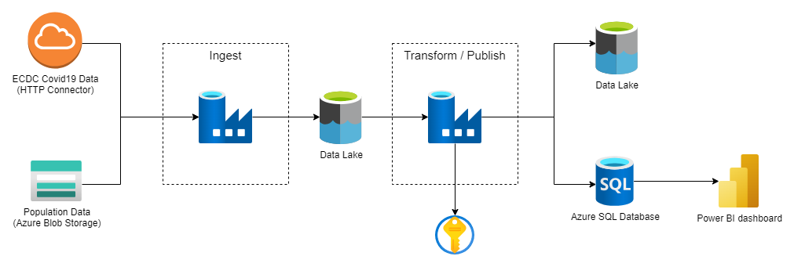

# Cloud-Based ETL on COVID-19 Data

## Project Description

This project implements a cloud-based ETL pipeline to handle COVID-19 data. The ETL pipeline extracts data from the European Centre for Disease Prevention and Control (ECDC) and population data, processes it, and loads the resulting datasets into a SQL database. The final datasets are intended for use in BI reports.

This project is the result of this [Udemy course](https://www.udemy.com/course/learn-azure-data-factory-from-scratch).

This repo includes the source code of the data factory, infrastructure .bicep file to provision Azure resources, yml files to create github workflows and source data csv files.

Solution is built on Azure cloud.

## Architecture



The architecture leverages various Azure resources:

- **Data Factory (ADF):** To create and maintain the ETL pipelines.
- **Storage Account:** To store the raw and processed data.
- **Data Lake:** To hold the ingested data and intermediate results.
- **Key Vault:** To securely manage credentials.
- **SQL Server:** To store the final transformed data.

## Deploying with Azure CLI

1. Clone the repo.
2. Login to Azure
   
    ```shell
    az login
    ```
3. Go to **infra** directory and run **main.bicep** file. Replace **yourResourceGroup** with the resource group where yo want to create the resources.

    ```shell
      az deployment group create --resource-group yourResourceGroup --template-file main.bicep
    ```
4. It will prompt you to provide some parameters `envPrefix`, `appName`, `administratorLogin`, `administratorLoginPassword`
    - `envPrefix` is the prefix of the environment you are deploying to: dev, test, prod... The input value will be used as a prefix to all resources names.
    - `appName` is the standard name to be used on resource naming. At the end resources will be created with the following format: **envPrefix**-**appName**-**resorceType**.
    - `administratorLogin` and `administratorLoginPassword` are the admin user credentials for the sql server login.
  Take note of the script result. You will need some urls in further steps. However, the information can be taken from the azure portal too.

5. When `az deployment group create` finished you will end up with the following resources and configuration (assuming `envPrefix` as **dev** and `appName` as **covidapp**)
    - Storage account (devcovidappstrgacct) with 2 containers: _configs_ and _population_.
    - Data lake storage account (devcovidappdl) with 3 containers: _raw_, _processed_ and _lookup_.
    - Key vault (dev-covidapp-kv) with a secret called _covid-demo-db-pwd_ with the value of `administratorLoginPassword`
    - Data factory (dev-covidapp-adf)
    - SQL server (dev-covidapp-db-srv) and SQL database (dev-covidapp-db). The login credentials are `administratorLogin` and `administratorLoginPassword`

6. Configure git in your ADF to reference your cloned repo. See: [source control](https://learn.microsoft.com/en-us/azure/data-factory/source-control)

## Continous Deployment

The repo includes yml files to create a github workflow that is capable to deploy the ADF artifact to _test_ and _production_ environments. The workflow **does not** deploy infrastructue resources, it **only** deploys the ADF artifacts. It means that resources must exist before deploying the ADF artifacts.

1. As github needs to authenticate to azure, follow [these](https://learn.microsoft.com/en-us/azure/developer/github/connect-from-azure?tabs=azure-portal%2Cwindows#use-the-azure-login-action-with-a-service-principal-secret) steps to create a service principal in Azure and configure the credentials in github.
2. Create the following environment secrets in Github:
   - AZURE_CREDENTIALS. Has the value of the previous step.
   - AZURE_RG. The resource group name.
   - AZURE_SUBSCRIPTION. The subscription id.
   - BLOB_STORAGE_ENDPOINT. Endpoint of the storage account.
   - DATA_LAKE_STORAGE_URL. Endpoint of the data lake storage.
   - KEYVAULT_URL. Url of the keyvault.
   - DB_CREDENTIALS_USERNAME. User name for sql server login.
   - DB_SERVER_NAME. Database server name. This is the name of the existing azure database server.
   - DB_NAME. Database name. This is the name of the existing azure database.

  All the urls can be found in azure portal.

## Data Sources

1. **Eurostat Website:**
   - Population by age
2. **ECDC Data:**
   - Confirmed cases
   - Mortality
   - Hospitalization / ICU Cases
   - Testing numbers


## **Disclaimer**

The following sections will be completed incrementally.

## ETL Pipeline Overview

### Pipeline Flows

#### 1. Population Data Flow

#### 2. ECDC Data Flow

### Detailed Pipeline Steps
